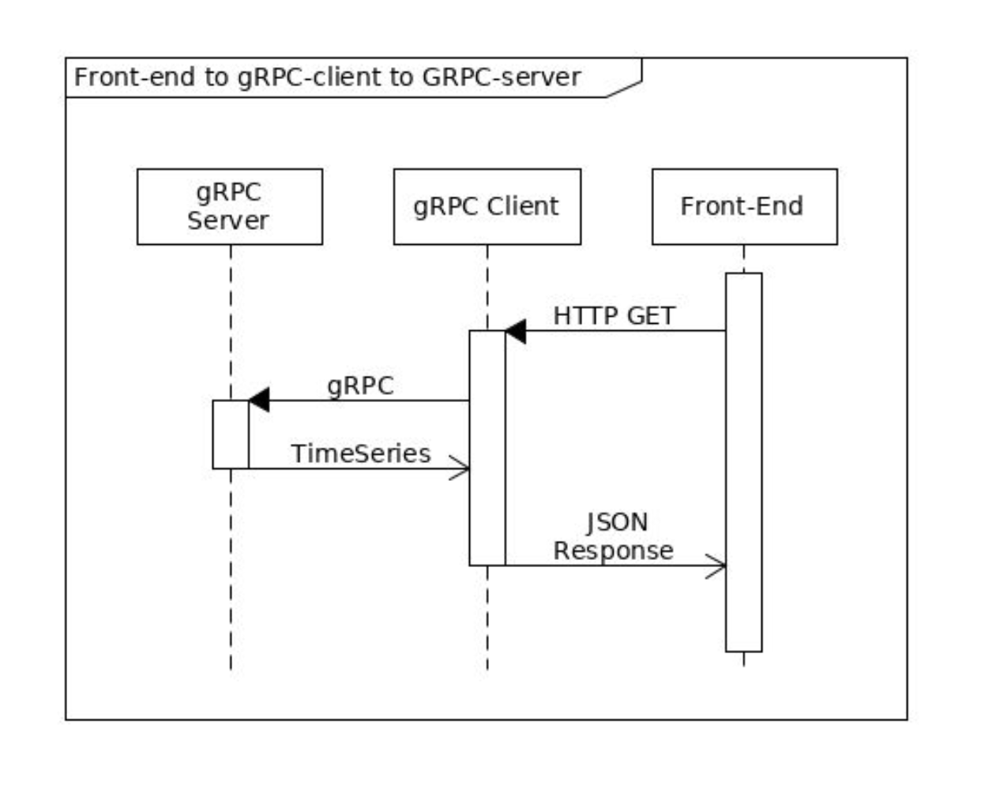

# Python gRPC-based microservice

## Architecture  
The design consists of a gRPC server that serves the time based electricity consumption data found in data/meterusage.csv,  
an HTTP server that will request the data from the gRPC server and deliver the consumption data as JSON and  
a frontend (a single page HTML document), that requests the JSON from the HTTP server and displays it.  
The system design is represented in the image below:

<p style="width: 40em; align-items: center">
  
</p>

## Description
I started by creating the meterusage.proto file to define the contract / specification of request and response to the gRPC server  
as indicated in MeterUsageService. I then used the grpc tools command together with the meterusage.proto file to generate  
meterusage_pb_2.py and meterusage_pb_2_grpc.py files, which contains the generated client and server classes. Next, I defined GetMeterUsage   
function under MeterUsageService class in the grpc server file (grpc_serer.py). The function open the meterusage.csv file and serves the data   
using the format defined in the MeterUsageResponse message.  
Also, as mentioned in the Decisions section below, I used a simplified approach for handling NaNs; by replacing them with 0.0.
<br>

I then created an HTTP server using FastAPI (defined in app.py) which makes a gRPC call to GetMeterUsage function on the gRPC server  
using the defined MeterUsageRequest and in turn returns the time-series data from the gRPC server in JSON fromat.  
I also added a test in app_test.py which mocks the request to the gRPC server and asserts the expected response.
<br>

After, I created a single page frontend client (frontend/index.html) which uses the JavaScript fetch API to make an HTTP GET request  
to the HTTP server and then render the JSON response in an HTML table.<br>

So finally, after starting up both servers (using the steps in How to set up below), opening `http://localhost:8081/frontend/index.html`  
in the browser kicks off the request to the HTTP server which in-turn makes a gRPC call to the gRPC server and then renders the return  
JSON data in an HTML Table.


## How to set up

### With Docker
1. Clone the repository
```bash
git clone https://github.com/mhope-2/grpc-based-microservice.git
```
2. Startup services using docker
```bash
docker-compose up 
``` 

**NB:** I couldn't get the docker approach up and running on my end due to multiple timeouts, resulting from a recent Internet outage

### Without Docker
This assumes a Unix-based OS, with Python installed

1. Clone the repository
```bash
git clone https://github.com/mhope-2/grpc-based-microservice.git
```
2. Create a Python virtual environment
```bash
python3 -m venv env
```
2. Activate the virtual environment on two terminal sessions, in each terminal session, run:
```bash
source env/bin/activate
```
3. Install requirements / dependencies
```bash
pip install -r requirements.txt
```
4. Start the gRPC server in one terminal
```bash
python grpc_server.py
```
6. Start the HTTP server on the other terminal
```bash
uvicorn app:app --reload --port 8081
```
7. To view the frontend page (make request to the HTTP server), open the link below in your browser
```angular2html
http://localhost:8081/frontend/index.html
```

### Running Test
Test command
```bash
pytest
```

### Decisions
1. Python builtin csv package vs pandas: I chose the in-built Python csv module to keep things light and simple. I would use a more specialized package like pandas in case of multiple data cleaning steps.
2. Handling NaNs: There are various approaches to handling data anomalies, which includes NaNs, I went with replacing them with 0.0 in order to still keep the data point for the given timestamp.
